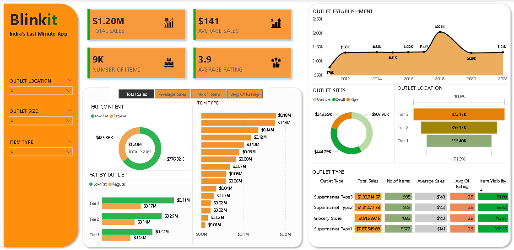
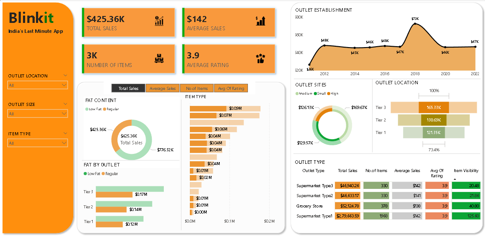
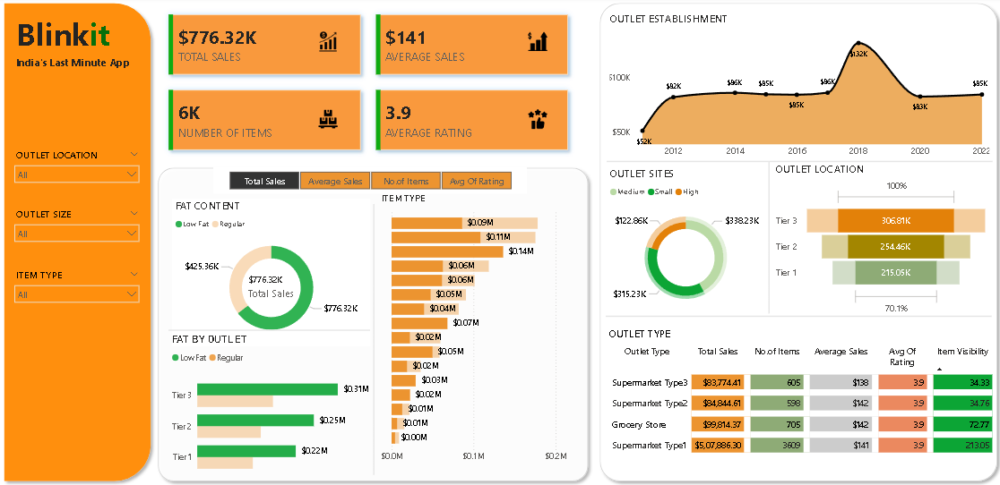
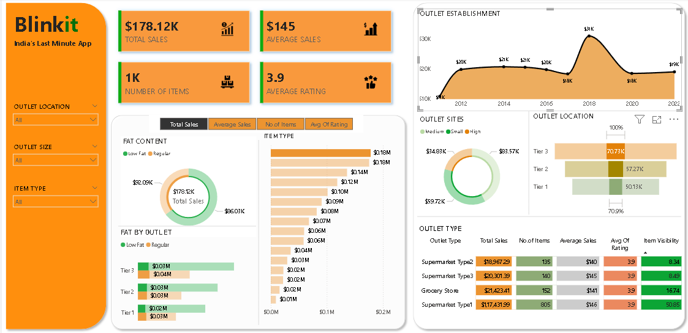

# Blinkit Sales Analysis Dashboard

## Project Overview

The Blinkit Sales Analysis Dashboard is an interactive Power BI project developed to analyze grocery sales data and present meaningful business insights through clear and interactive visualizations.

The main objective of this project is to monitor sales performance, understand customer purchasing patterns, compare outlet performance, and identify the product categories that contribute the most to overall revenue. The dashboard is designed to help business users make data-driven decisions by providing a complete overview of sales and operational performance in one place.

---

## Business Problem

Blinkit operates through multiple outlet types, outlet sizes, and locations while selling thousands of grocery products. Analyzing sales data manually becomes difficult as the business grows.

This dashboard addresses the following business questions:

- Which outlet type generates the highest sales?
- Which outlet location performs the best?
- Which product categories contribute the most revenue?
- How has sales performance changed over the years?
- Which outlet size is most profitable?
- What is the average customer rating across products?
- How do fat content categories affect sales?

---

## Dashboard Preview

### Overall Dashboard



---

### Location Filter



---

### Outlet Size Filter



---

### Item Type Filter



---

## Dashboard Features

The dashboard includes multiple interactive visuals that provide insights into different aspects of the business.

### KPI Cards

The dashboard displays four important KPIs:

- **Total Sales:** $1.20M
- **Average Sales:** $141
- **Number of Items:** 9K
- **Average Rating:** 3.9

These KPIs provide a quick overview of overall business performance.

---

### Sales Trend Analysis

The Outlet Establishment chart shows how sales have changed based on the establishment year of outlets.

This visualization helps identify:

- Growth trends
- High-performing years
- Business expansion patterns

---

### Fat Content Analysis

This section compares sales generated by:

- Low Fat products
- Regular products

It helps understand customer preferences based on product fat content.

---

### Item Type Analysis

The dashboard compares total sales across different product categories such as:

- Fruits & Vegetables
- Snack Foods
- Household
- Dairy
- Frozen Foods
- Beverages
- Health & Hygiene
- Meat
- Canned Food
- Baking Goods
- Breakfast
- Seafood
- Hard Drinks
- Others

This allows users to identify the highest-selling product categories.

---

### Outlet Analysis

The dashboard compares outlet performance using multiple dimensions.

#### Outlet Size

- Small
- Medium
- High

#### Outlet Location

- Tier 1
- Tier 2
- Tier 3

#### Outlet Type

- Grocery Store
- Supermarket Type1
- Supermarket Type2
- Supermarket Type3

These visualizations help identify which outlet category contributes the highest revenue.

---

### Interactive Filters

Users can filter the dashboard using:

- Outlet Location
- Outlet Size
- Item Type

These slicers allow dynamic exploration of the data without modifying the dashboard.

---

## Key Insights

After analyzing the dashboard, the following insights were observed:

- The total sales reached **$1.20M**.
- Average sales per transaction are **$141**.
- More than **9,000 products** are included in the analysis.
- The average customer rating is **3.9**.
- Tier 3 outlets generated the highest overall sales.
- Supermarket Type 1 contributed the largest share of total revenue.
- Regular fat products generated higher sales than low-fat products.
- Fruits & Vegetables and Snack Foods were among the top-performing product categories.
- Sales peaked for outlets established around 2018.
- Different outlet sizes contribute differently to overall business performance.

---

## Tools and Technologies

The following tools were used during the development of this project:

- Power BI
- Microsoft Excel
- Power Query
- DAX (Data Analysis Expressions)

---

## Skills Demonstrated

This project demonstrates practical skills in:

- Data Cleaning
- Data Transformation
- Data Modeling
- DAX Calculations
- KPI Development
- Dashboard Design
- Business Intelligence
- Data Visualization
- Interactive Reporting

---

## Project Structure

```
blinkit-sales-analysis-dashboard
│
├── Dashboard
│   └── Blinkit Dashboard.pbix
│
├── Dataset
│   └── BlinkIT Grocery Data.xlsx
│
├── Images
│   ├── Dashboard.png
│   ├── Outlet Location.png
│   ├── Outlet Size.png
│   └── Item Type.png
│
└── README.md
```

---

## How to Use

1. Download or clone this repository.
2. Open the `.pbix` file using Power BI Desktop.
3. If required, reconnect the dataset.
4. Explore the dashboard using the available filters.
5. Analyze KPIs and visualizations to gain business insights.

---

## Future Improvements

Some enhancements that can be added in future versions include:

- Profit Analysis
- Monthly Sales Trends
- Customer Segmentation
- Regional Sales Comparison
- Forecasting using Power BI
- Mobile Dashboard Optimization

---

## Conclusion

This project demonstrates how Power BI can transform raw sales data into meaningful business insights through interactive dashboards. By combining KPIs, charts, filters, and comparative visualizations, the dashboard provides an easy-to-understand overview of Blinkit's sales performance and supports better business decision-making.

---

## Author

**Jayanth Neeleswara**

Aspiring Data Analyst passionate about transforming raw data into meaningful insights using SQL, Excel, Power BI, and Python.
